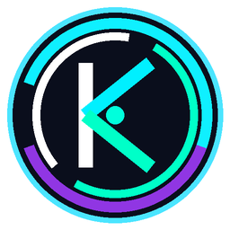
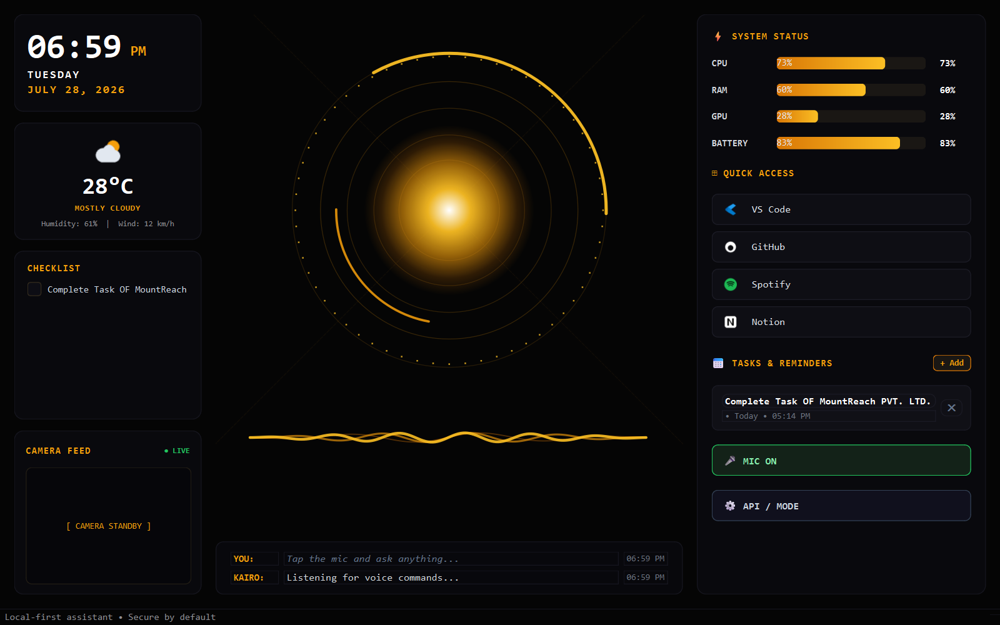

<div align="center">



<h1>
  
</h1>

<p><em>A production-ready desktop AI assistant with voice, vision, and full Windows automation — powered by local-first AI.</em></p>

<br/>

[](https://python.org)
[](https://riverbankcomputing.com/software/pyqt/)
[](https://github.com/ggerganov/llama.cpp)
[](https://github.com/openai/whisper)
[](https://huggingface.co/hexgrad/Kokoro-82M)
[](https://microsoft.com/windows)

<br/>

[](https://github.com/Pratik-R-Palkar/Kairo-AI-Assistent/stargazers)
[](https://github.com/Pratik-R-Palkar/Kairo-AI-Assistent/network/members)
[](https://github.com/Pratik-R-Palkar/Kairo-AI-Assistent/issues)
[](LICENSE)

</div>

---

## ✨ Live Preview

<div align="center">
  
  <br/>
  <sub>⚡ KAIRO HUD — Real-time system monitor, Arc Reactor core, voice waveform, and quick-launch panel</sub>
</div>

---

## 🚀 Features at a Glance

<div align="center">

| 🎙️ Voice Control | 👁️ Vision AI | 🧠 Local LLM | 🖥️ Desktop Automation |
|:-:|:-:|:-:|:-:|
| Wake-word detection | Screen & camera analysis | Offline GGUF models | App launch & control |
| Groq Whisper STT | Cloud vision fallback | Multi-model routing | Keyboard & mouse |
| ElevenLabs TTS | Object & text detection | Reasoning chains | Volume & brightness |
| Kokoro local voice | Privacy-first by default | Fast cloud fallback | Power management |

</div>

---

## ⚡ Quick Start (Windows Installer)

<div align="center">

```
1. Download setup.exe from Releases
2. Install → Launch KAIRO
3. Enter your API keys once in the setup screen
4. Done — KAIRO is ready to use 🎉
```

[](../../releases)

</div>

> ⚠️ **Never commit your `.env` file or any API keys.** Use `.env.example` as a template.

> To Close Kairo Press: alt+f4

---

## 🔑 API Keys — Where to Get Them

KAIRO uses several cloud services for voice and AI. Here are direct links to sign up and get your keys:

### 1. 🟠 OpenRouter — Main AI Brain
Used for cloud LLM responses (GPT, Claude, Gemini, Llama, and more via one key).

[](https://openrouter.ai/keys)

```
Sign up free → Create API Key → Copy key starting with sk-or-v1-...
Free tier: many open-source models available at no cost
```

### 2. 🟢 Groq — Voice Transcription (STT)
Used for ultra-fast speech-to-text via Whisper Large v3.

[](https://console.groq.com/keys)

```
Sign up free → API Keys → Create API Key → Copy key starting with gsk_...
Free tier: 7,200 seconds/day of audio transcription
```

### 3. 🔵 ElevenLabs — Voice Synthesis (TTS)
Used for realistic, expressive AI voice output.

[](https://elevenlabs.io/app/settings/api-keys)

```
Sign up free → Profile → API Keys → Copy key starting with sk_...
Free tier: 10,000 characters/month
```

### 4. 🔴 Gemini — Optional Google AI
Used as an optional AI provider or fallback.

[](https://aistudio.google.com/apikey)

```
Sign in with Google → Create API Key → Copy key starting with AIzaSy...
Free tier: 15 requests/minute with Gemini Flash
```

### 5. ⚫ OpenAI — Optional GPT Models
Used if you prefer GPT models directly.

[](https://platform.openai.com/api-keys)

```
Sign up → API Keys → Create secret key → Copy key starting with sk-...
Requires billing — strong GPT-4o-mini tier available
```

### 6. 🟤 Anthropic — Optional Claude Models
Used if you prefer Claude models directly.

[](https://console.anthropic.com/settings/keys)

```
Sign up → API Keys → Create Key → Copy key starting with sk-ant-...
Requires billing
```

---

## 🖥️ System Requirements

<div align="center">

| Spec | Minimum | Recommended |
|:-----|:-------:|:-----------:|
| 🪟 OS | Windows 10 | Windows 11 |
| 🧠 RAM | 8 GB | 16 GB+ |
| ⚙️ CPU | 4-core | 8-core |
| 🎮 GPU | Optional | NVIDIA (CUDA) |
| 🐍 Python | 3.10+ | 3.12 |

</div>

---

## 🤖 AI Modes

<details>
<summary><b>☁️ Cloud AI Mode</b> — Click to expand</summary>
<br/>

- Uses internet APIs when available
- Best for fast responses and large-context tasks
- Requires at minimum an **OpenRouter** or **Groq** API key
- Automatic fallback to local models when offline

```env
KAIRO_CLOUD_ONLY=false
KAIRO_LLM_PROVIDER=openrouter
KAIRO_LLM_FALLBACKS=groq,openrouter
KAIRO_STT_PROVIDER=groq
KAIRO_TTS_PROVIDER=elevenlabs
GROQ_API_KEY=gsk_...
OPENROUTER_API_KEY=sk-or-v1-...
ELEVENLABS_API_KEYS=sk_...
GEMINI_API_KEY=AIzaSy...
```

</details>

<details>
<summary><b>💻 Local / Offline Mode</b> — Click to expand</summary>
<br/>

- Full offline capability — zero data sent to cloud
- Privacy-first by design
- Works with just RAM — no GPU required

```env
KAIRO_CLOUD_ONLY=false
KAIRO_LLM_PROVIDER=local
KAIRO_LLM_FALLBACKS=
KAIRO_STT_PROVIDER=local
KAIRO_TTS_PROVIDER=kokoro
KAIRO_TTS_MODEL_REPO=hexgrad/Kokoro-82M
```

</details>

---

## 🏗️ Developer Setup

<details>
<summary><b>Manual Setup Instructions</b> — Click to expand</summary>
<br/>

```powershell
# 1. Create a virtual environment
python -m venv .venv
.venv\Scripts\activate

# 2. Install dependencies
pip install -r requirements.txt

# 3. Configure environment
copy .env.example .env
# Edit .env and fill in your API keys

# 4. Run KAIRO
python main.py
```

### Build Windows Installer

```powershell
# Requires Inno Setup 6: https://jrsoftware.org/isdl.php
.\build.ps1
# Output: dist\setup.exe
```

</details>

---

## 🎤 Desktop Voice Control

<div align="center">

| Command Category | Example Commands |
|:----------------|:----------------|
| 🖥️ **App Control** | `Kairo, open Chrome` · `minimize this window` · `snap window left` |
| ⌨️ **Typing** | `type hello world and press enter` · `press control shift T` |
| 🖱️ **Mouse** | `move cursor to 800 450` · `double click at 800 450` · `click Settings` |
| 🔊 **System** | `set volume to 40` · `mute` · `set brightness to 70` |
| 🎵 **Media** | `play` · `pause` · `fullscreen` · `skip` · `take a screenshot` |
| ⚡ **Power** | `lock my PC` · `restart` · `shutdown` *(requires spoken confirm)* |

</div>

> 🔒 Power commands (restart, shutdown, sleep, sign-out) require a second spoken `confirm` by default.
> Set `KAIRO_DESKTOP_POWER_CONFIRMATION=false` to disable this safeguard.

---

## 📦 Recommended Local Models

<div align="center">

| 💻 System | 🧠 RAM | 🤖 Recommended Model |
|:---------:|:------:|:-------------------:|
| Low-end laptop | 8 GB | Qwen2.5-Coder 1.5B *(bundled)* |
| Mid-range desktop | 16 GB | Qwen2.5-Coder 1.5B or 3B-class |
| High-end desktop | 32 GB+ | 7B+ class GGUF models |

</div>

---

## 🔒 Privacy & Security

<div align="center">

```
🔐 API keys stored locally in %LocalAppData%\KAIRO\.env — never in install directory
🚫 Local mode sends ZERO data to any cloud service
👁️ Screen & camera only uploaded on explicit user request
🔊 Power commands always require spoken confirmation
```

</div>

---

## 🛠️ Built With

<div align="center">

[](https://python.org)
[](https://riverbankcomputing.com/software/pyqt/)
[](https://github.com/ggerganov/llama.cpp)
[](https://github.com/openai/whisper)
[](https://huggingface.co/hexgrad/Kokoro-82M)
[](https://elevenlabs.io)
[](https://groq.com)
[](https://openrouter.ai)

</div>

---

<div align="center">


[](https://github.com/Pratik-R-Palkar/Kairo-AI-Assistent)

</div>
